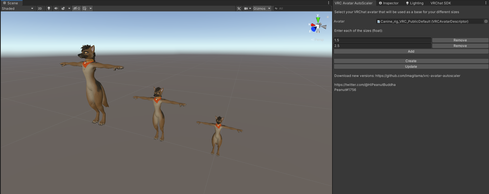

# VRC Avatar AutoScaler

A Unity plugin that scales your VRChat avatar to different sizes for easy uploading. It:

- clones your avatar
- scales the `GameObject` X times for each scale amount you want
- moves the VRC viewpoint
- updates each one whenever you change the source avatar 

## Usage

I recommend your scene only has 1 avatar in it.

1. Drag your "source" VRChat avatar into the input
2. Create different sizes
3. Click "Create" and it will clone the source avatar, scale it and spread it into your scene
4. Manually publish each avatar (working on doing this automatically)

If you ever change the source avatar you can "update" all existing avatars in the scene:

1. Drag your "source" VRChat avatar into the input
2. Click "Update" and it will re-create each cloned avatar in the scene using the source but preserving the blueprint ID

### Quest versions

1. Perform above steps (including publishing to VRC)
2. Switch to Android mode
3. Replace the "source" VRChat avatar with your Quest version
4. Drag the new Quest "source" VRChat avatar into the input
5. Click "Update" and all versions will have the correct blueprint ID plus be Quest compatible 
